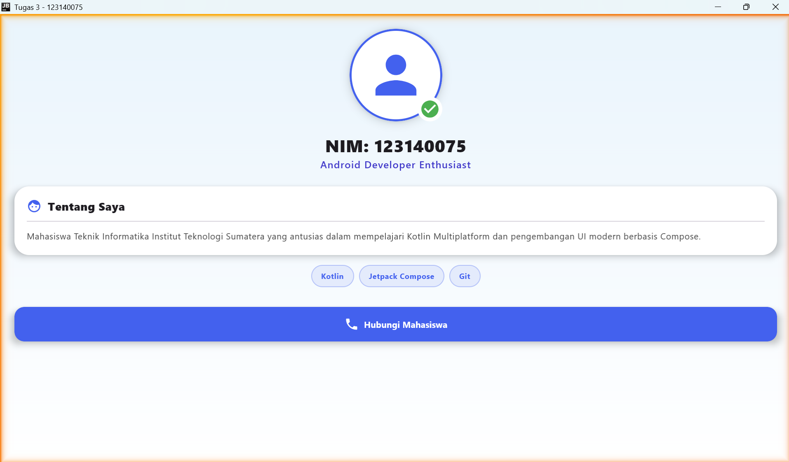
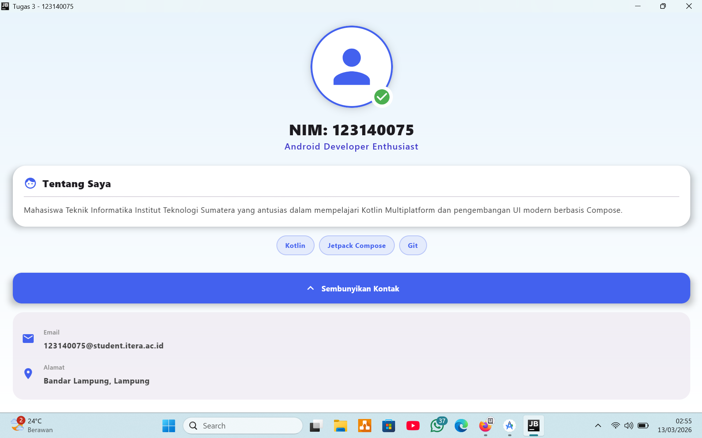

# Tugas 3 - Pengembangan Aplikasi Mobile

## Deskripsi
Aplikasi Profile Mahasiswa yang dikembangkan menggunakan **Kotlin Multiplatform (KMP)** dengan **Jetpack Compose**. Aplikasi ini menampilkan profil pengguna, informasi akademik, keahlian, dan detail kontak yang interaktif.

## NIM: 123140075

## Komponen Penilaian yang Terpenuhi
- [x] **Layout Implementation**: Menggunakan `Scaffold`, `Box`, `Column`, dan `Row` untuk struktur UI yang responsif.
- [x] **Reusable Composables**: Pemisahan komponen UI menjadi fungsi-fungsi kecil (Header, Identity, About, Skill, Contact) untuk kemudahan *maintenance*.
- [x] **UI Components**: Implementasi penuh menggunakan Material3 (`Card`, `Button`, `Icon`, `Text`, `Surface`, `Divider`).
- [x] **Modifiers**: Penggunaan *styling* tingkat lanjut (`Shadow`, `Clip`, `Border`, `Gradient Background`).
- [x] **Bonus**: Animasi interaktif menggunakan `AnimatedVisibility` dengan *custom tween animation*.

## Screenshot Aplikasi

| Kondisi Awal | Setelah Klik "Lihat Kontak" |
| :---: | :---: |
|  |  |

## Cara Menjalankan
1. Clone repository ini ke Android Studio.
2. Pastikan Gradle melakukan *Sync* hingga selesai.
3. Pilih perangkat (Emulator/Desktop) lalu klik tombol **Run**.

---
*Dibuat untuk memenuhi tugas mata kuliah Pengembangan Aplikasi Mobile.*
